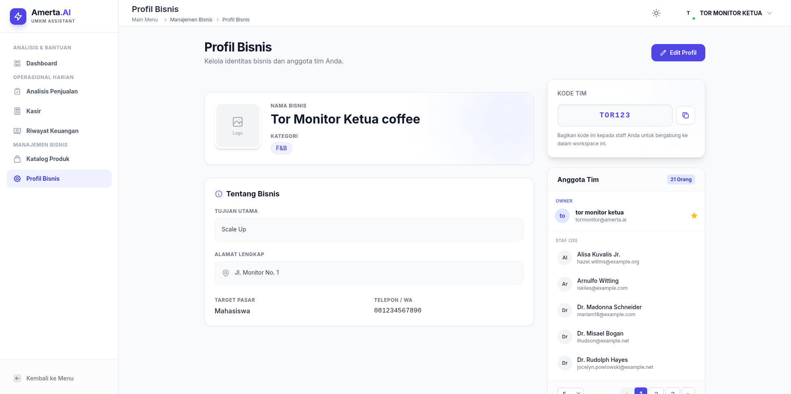

# Amerta AI - Manajemen Keuangan Dengan Fitur AI

   
  
    
  
<b>Website pembantu UMKM dalam mengatur keuangan, disertai asisten AI untuk kemudahan</b>

  
  
  
  
  

    
  <a href="INSTALLATION.md">Instalasi</a> |
  <a href="CONTRIBUTION.md">Kontribusi</a> |
  <a href="TECHSTACK.md">Tech Stack</a>

---

## Pengenalan

Amerta AI adalah website all-in-one yang dirancang untuk menjadi solusi digital universal bagi seluruh jenis Usaha Mikro, Kecil, dan Menengah (UMKM) di Indonesia, melampaui batasan aplikasi Point-of-Sale (POS) atau akuntansi konvensional. Target kami adalah membantu UMKM sektor barang (toko, online shop) maupun sektor jasa (barbershop, bengkel, laundry, klinik, katering) mengatasi masalah inti: stabilitas keuangan, promosi yang efektif, dan manajemen keuangan.

---

## Fitur Utama Amerta AI

<a href= https://drive.google.com/drive/u/1/folders/1k98PskArAn0gZW4Y3i6CODq9-wki4BjY>Link Video Demo</a>
<a href= http://amerta-ai-production.up.railway.app>Release</a>

  <table>
    <tr>
      <th align="left">Deskripsi Fitur</th>
      <th align="left">Tampilan Visual</th>
    </tr>
    <tr>
      <td>
        <strong>Dashboard Data & Grafik</strong> 
        Visualisasi data keuangan dari bisnis yang dimiliki memudahkan pengguna menganalisis hasil penjualan serta pengeluaran berdasarkan waktunya.
      </td>
      <td>
        
      </td>
    </tr>
    <tr>
      <td>
        <strong>Katalog Produk Bisnis</strong> 
        Visualisasi berbagai jenis produk yang sudah dibuat beserta analisis profit dan margin dari produk tersebut. Dengan masukan dari AI untuk mengatur harga promo dari produk tersebut.
      </td>
      <td>
        
      </td>
    </tr>
    <tr>
      <td>
        <strong>Laporan Harian Penjualan Produk</strong> 
        Tiap tiap tanggal dalam kalender untuk mencatat produk yang terjual beserta total omset dan profit yang didapat.
      </td>
      <td>
        
      </td>
    </tr>
    <tr>
      <td>
        <strong>Detail Laporan Penjualan Produk</strong> 
        Menampilkan detail laporan produk yang terjual berdasarkan tanggalnya. Dan insight yang diberikan AI untuk menambah wawasan bagi penjual produk.
      </td>
      <td>
        
      </td>
    </tr>
    <tr>
      <td>
        <strong>Pencatatan Riwayat Transaksi</strong> 
        Visualisasi riwayat yang sudah dilakukan oleh pengguna menggunakan catatan pemasukan dan pengeluaran.
      </td>
      <td>
        
      </td>
    </tr>
    <tr>
      <td>
        <strong>Profil Bisnis</strong> 
        Identitas bisnis beserta staf yang dapat diundang menggunakan kode referal.
      </td>
      <td>
        
      </td>
    </tr>
  </table>

---

## Dampak dan Keunggulan

### Dampak Nyata Yang Didapatkan

  <ul>
    <li>
      <strong>Efisiensi Manajemen Keuangan</strong> 
      Memberikan kemudahan bagi pelaku bisnis dalam mengatur keuangan berkat tampilan analisa keuangan
    </li>
    <li>
      <strong>Menghemat Waktu</strong> 
      Fungsionalitas yang mendukung kecepatan dalam menghitung dan mencatat data keuangan
    </li>
    <li>
      <strong>Operasi Bisnis Yang Rapi</strong> 
      Dengan fitur laporan harian menyajikan laporan penjualan dengan visualisasi menggunakan kalender
    </li>
  </ul>

### Keunggulan Dari Sistem Ini

  <ul>
    <li>
      <strong>Untuk Semua Jenis Usaha</strong> 
      Mendukung berbagai jenis usaha termasuk produk barang maupun jasa.
    </li>
    <li>
      <strong>Promosi Otomatis Berbasis Data</strong> 
      Dengan fitur Amerta Studio pengguna tidak perlu repot untuk memikirkan langkah-langkah dalam membuat promosi produk ataupun jasanya.
    </li>
    <li>
      <strong>Ringan dan Mudah Digunakan</strong> 
      Dengan hanya menekan, pengguna sudah bisa mencatat keuangan mereka tanpa perlu mengetik lagi.
    </li>
  </ul>

---
