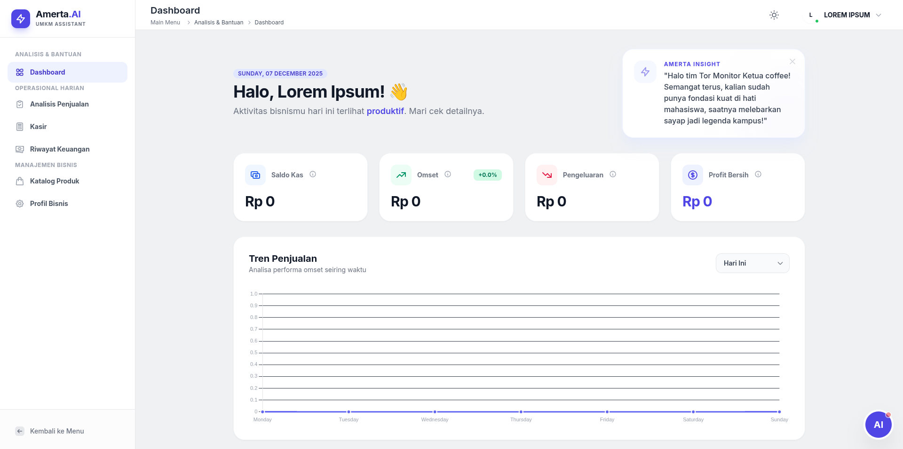
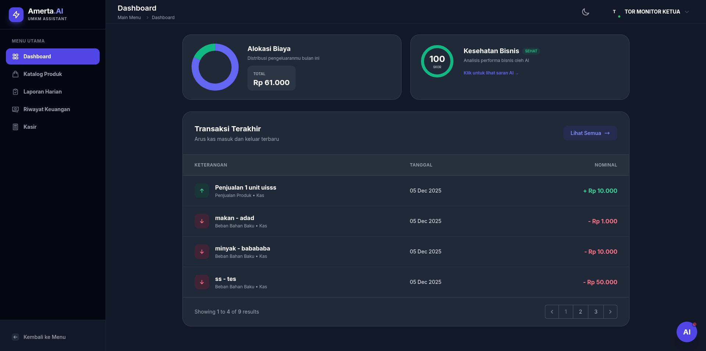
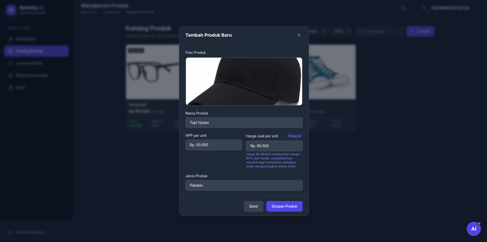
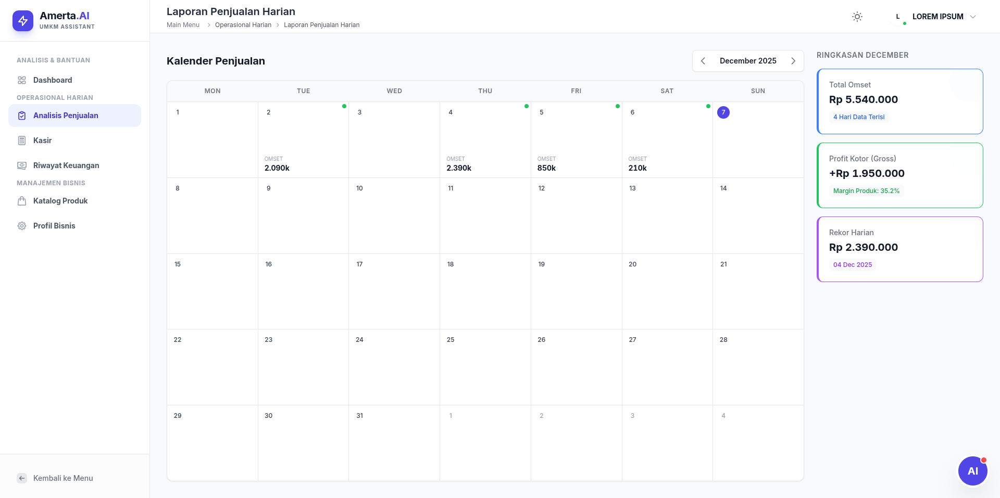
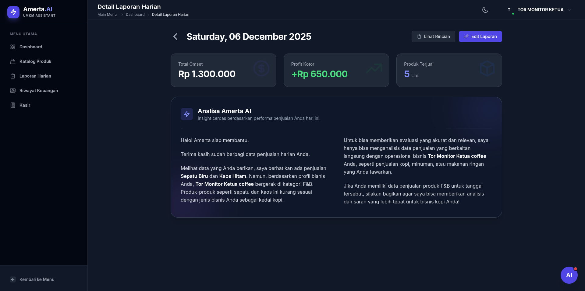
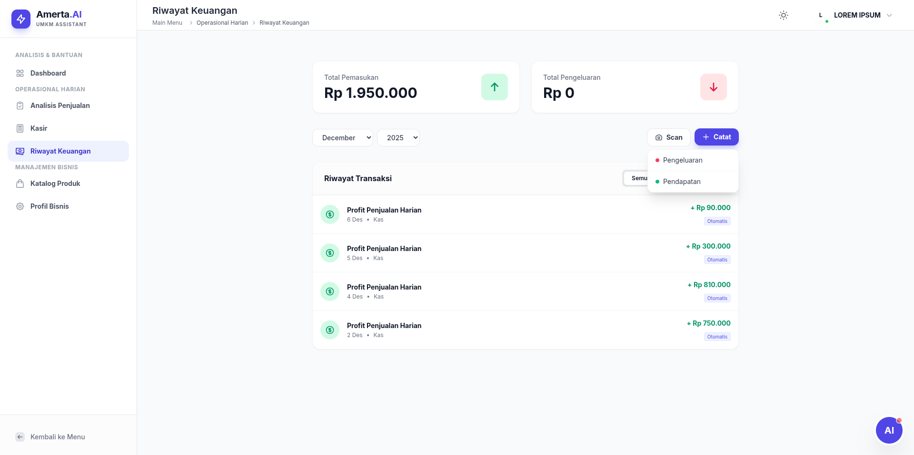

# Amerta AI - Manajemen Keuangan Dengan Fitur AI

   
  
    
  
<b>Website pembantu UMKM dalam mengatur keuangan, disertai asisten AI untuk kemudahan</b>

  
  
  
  
  

    
  <a href="INSTALLATION.md">Instalasi</a> |
  <a href="CONTRIBUTION.md">Kontribusi</a> |
  <a href="TECHSTACK.md">Tech Stack</a>

---

## Pengenalan

Amerta AI adalah website all-in-one yang dirancang untuk menjadi solusi digital universal bagi seluruh jenis Usaha Mikro, Kecil, dan Menengah (UMKM) di Indonesia, melampaui batasan aplikasi Point-of-Sale (POS) atau akuntansi konvensional. Target kami adalah membantu UMKM sektor barang (toko, online shop) maupun sektor jasa (barbershop, bengkel, laundry, klinik, katering) mengatasi masalah inti: stabilitas keuangan, promosi yang efektif, dan manajemen keuangan.

---

## Fitur Utama Amerta AI

| Deskripsi Fitur | Tampilan Visual |
| :--- | :--- |
| **Dashboard Data & Grafik**   Visualisasi data keuangan dari bisnis yang dimiliki memudahkan pengguna menganalisis hasil penjualan serta pengeluaran berdasarkan waktunya. |  |
| **Dashboard Transaksi Serta Kesehatan Bisnis**   Menampilkan transaksi terakhir yang dilakukan termasuk arus kas yang masuk dan keluar. |  |
| **Katalog Produk Bisnis**   Visualisasi berbagai jenis produk yang sudah dibuat beserta analisis profit dan margin dari produk tersebut. |  |
| **Fitur Bantuan AI Untuk Menambah Produk**   Kemudahan bagi pengguna yang didapatkan dari masukan AI. |  |
| **Laporan Harian Penjualan Produk**   Tiap tiap tanggal dalam kalender untuk mencatat produk yang terjual beserta total omset dan profit yang didapat. |  |
| **Detail Laporan Penjualan Produk**   Menampilkan detail laporan produk yang terjual berdasarkan tanggalnya. Dan insight yang diberikan AI untuk menambah wawasan bagi penjual produk. |  |
| **Pencatatan Riwayat Transaksi**   Visualisasi riwayat yang sudah dilakukan oleh pengguna menggunakan pencatatan pemasukan dan pengeluaran. |  |

---

## Dampak dan Keunggulan

### Dampak Nyata Yang Didapatkan
- **Efisiensi Manajemen Keuangan**  
  Memberikan kemudahan bagi pelaku bisnis dalam mengatur keuangan berkat tampilan analisa keuangan

- **Menghemat Waktu**  
  Fungsionalitas yang mendukung kecepatan dalam menghitung dan mencatat data keuangan

- **Operasi Bisnis Yang Rapi**  
  Dengan fitur laporan harian menyajikan laporan penjualan dengan visualisasi menggunakan kalender

### Keunggulan Dari Sistem Ini
- **Untuk Semua Jenis Usaha**  
  Mendukung berbagai jenis usaha termasuk produk barang maupun jasa.

- **Promosi Otomatis Berbasis Data**  
  Dengan fitur Amerta Studio pengguna tidak perlu repot untuk memikirkan langkah-langkah dalam membuat promosi produk ataupun jasanya.

- **Ringan dan Mudah Digunakan**  
  Dengan hanya menekan, pengguna sudah bisa mencatat keuangan mereka tanpa perlu mengetik lagi.
